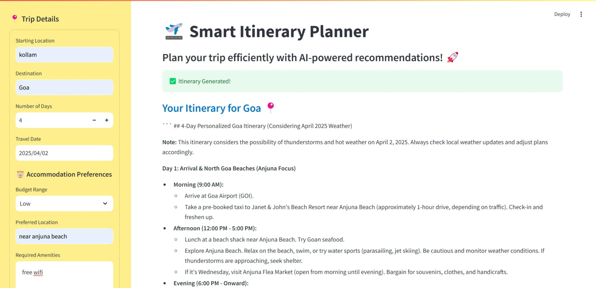

# Smart-Itinerary-Planner

Get curated travel itineraries, weather forecasts, accommodations, and transportation recommendations, all in one place.




## 🚀 Features
✅ Personalized Itineraries – AI-generated day-by-day travel plans based on your preferences.
✅ Best Attractions & Activities – Discover top-rated places and things to do.
✅ Accommodation Recommendations – Find the best hotels, resorts, or vacation rentals.
✅ Optimal Transportation Routes – Get the best travel options for flights, public transport, and car rentals.

## ⚙️ Tech Stack
* Python 🐍
* Streamlit – Interactive web UI
* CrewAI – Multi-agent system
* Google Gemini API – AI-powered responses
* Google Maps API – Location and transportation services
* Serper API – Real-time web search

## 📌 Setup & Installation

**1️⃣ Clone the Repository**
```bash
git clone https://github.com/your-username/AI-Travel-Planner.git
cd AI-Travel-Planner
```

**2️⃣ Install Dependencies**
```bash
pip install -r requirements.txt
```
**3️⃣ Set Up API Keys**
Create a .env file in the project directory and add:

```bash
GOOGLE_API_KEY=your_google_api_key
SERPER_API_KEY=your_serper_api_key
GOOGLE_MAPS_API_KEY=your_google_maps_api_key
```

**4️⃣ Run the App**
```bash
streamlit run app.py
```

## 🎯 How It Works
1️⃣ Enter your destination, travel dates, and accomodation preferences in the web app.
2️⃣ The AI agents gather travel recommendations, weather forecasts, and accommodations.
3️⃣ The itinerary builder creates a structured travel plan with optimal routes.
4️⃣ View your final itinerary with maps and estimated travel times.

## Demo video

[video]](images/streamlit-app-2025-03-31-19-03-11.webm)

## 💡 Future Improvements

* Integration with hotel booking APIs
* Multi-city travel planning

## 💌 Contact
📧 Kavya Sree – kavyasree42@gmail.com